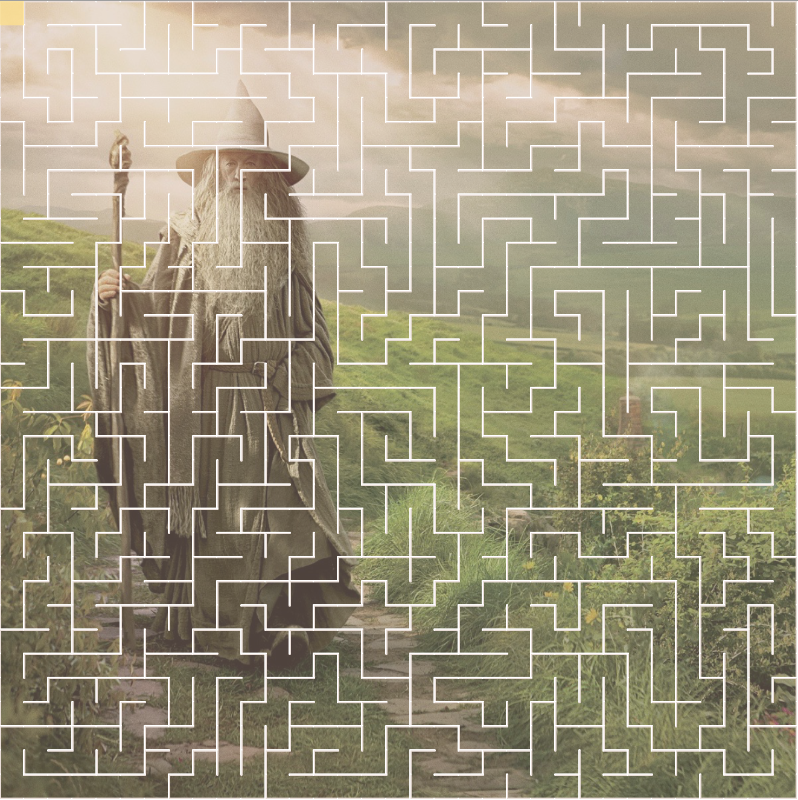

Kya Hover

# Final
## Self Generating Maze

I started my project by working on coding the self generating maze. I looked through all of the different maze generator algorithms and I found the recursive backtracker method to be the most suitable for my project. Thankfully, Shiffman had a video on how to make self generating mazes based off of the recursive backtracker algorithm found on [wikipedia](https://en.wikipedia.org/wiki/Maze_generation_algorithm#Recursive_backtracker). I followed along with his maze coding challenge and made my own without too many problems. I don't think that I would have been able to come up with all of it on my own yet!

After my self generating maze was mostly functional, I added in the background photo. I had some trouble getting my background image to load for quite a bit of time. I was opening my index.html file in Safari and it wouldn't allow me to open the image from the directory within my sketch folder. Eventually, I tried disabling the cross-origin restrictions in the Safari Develop tab and this fixed my problem. I don't know if this will have any problems loading on another computer. I sure hope not! --> Update: I found out that the real problem why my project wasn't loading was because I didn't have my local server running...I thought I did, but I didn't. I got the local server up and running and now it loads without any problems.

One problem that I found with my project is that it can take a lot of processing power and can slow down the computer since it is still running even when it has finished generating a maze.

Overall, I am happy with the final product of my maze. I was going for a simplistic look that wasn't too busy and I think that I was able to achieve this. Something that I wanted to do with my project but couldn't figure out how to do was to make the mazes solvable after they were generated. I couldn't think of any ways to make the random maze generate its own start and finish, and then ensure that there is a solution to it.

Compared with my original Gandalf coding project near the beginning of the semester, I'm pretty happy with the coding progress I've made! I'm still very new to coding, but I feel like I have had a good introduction and that I have come a long way!

