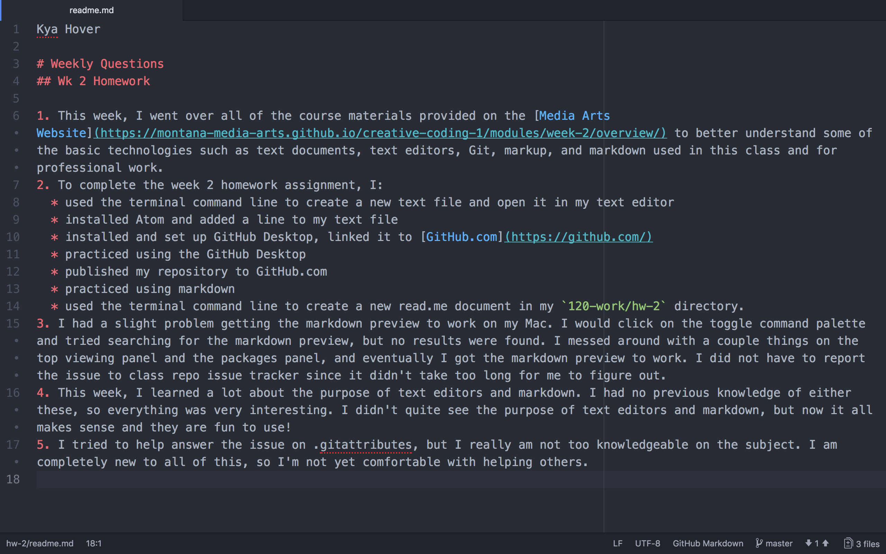

Kya Hover

# Weekly Questions
## Wk 2 Homework

1. This week, I went over all of the course materials provided on the [Media Arts Website](https://montana-media-arts.github.io/creative-coding-1/modules/week-2/overview/) to better understand some of the basic technologies such as text documents, text editors, Git, markup, and markdown used in this class and for professional work.
2. To complete the week 2 homework assignment, I:
  * used the terminal command line to create a new text file and open it in my text editor
  * installed Atom and added a line to my text file
  * installed and set up GitHub Desktop, linked it to [GitHub.com](https://github.com/)
  * practiced using the GitHub Desktop
  * published my repository to GitHub.com
  * practiced using markdown
  * used the terminal command line to create a new read.me document in my `120-work/hw-2` directory.
3. I had a slight problem getting the markdown preview to work on my Mac. I would click on the toggle command palette and tried searching for the markdown preview, but no results were found. I messed around with a couple things on the top viewing panel and the packages panel, and eventually I got the markdown preview to work. I did not have to report the issue to class repo issue tracker since it didn't take too long for me to figure out.
4. This week, I learned a lot about the purpose of text editors and markdown. I had no previous knowledge of either these, so everything was very interesting. I didn't quite see the purpose of text editors and markdown, but now it all makes sense and they are fun to use!
5. I tried to help answer the issue on .gitattributes, but I really am not too knowledgeable on the subject. I am completely new to all of this, so I'm not yet comfortable with helping others.

